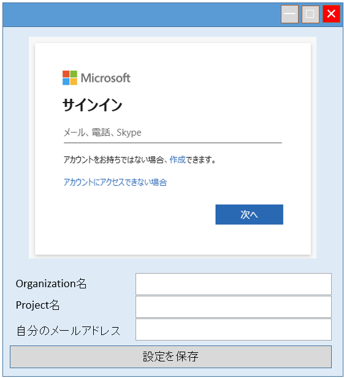
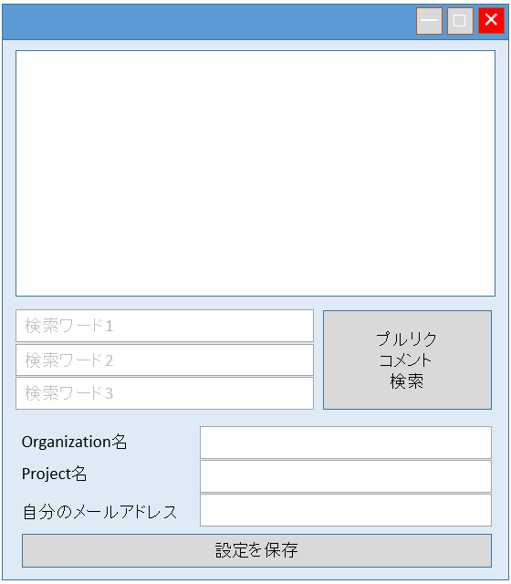
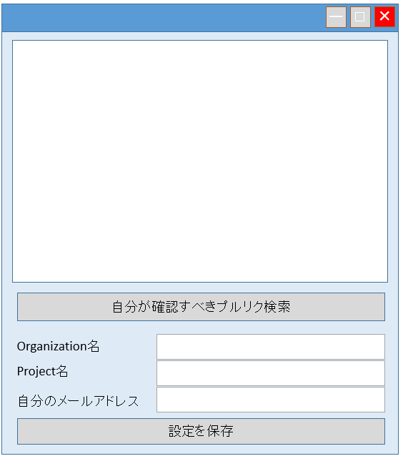

# イメージ

# 概要
AzureDevOpsのプルリクエストの情報を読み出し、下記を行う。
- 全部プルリクのコメントから、指定の文字列を検索し、リスト表示する。
- 自分が今確認するべきプルリク／プルリクコメントをリスト表示する。

# 画面イメージ

起動時画面（MSアカウントログイン画面）

プルリクコメント検索画面

自分が今確認すべきプルリク/プルリクコメント検索画面

# 機能

## 基本機能

- 指定のOrganization、Projectに出されているプルリクエストの情報を取得する。  
（リポジトリ名の指定はさせない。Projectの中に含まれる全リポジトリの情報を取得する）
- Organization、Projectは、画面から入力する。
- 起動後、ブラウザ画面を表示し、MSアカウントにログインさせる。
- ログインしたユーザーで、Azureにアクセスし、情報を取得する。  
（情報は、RestAPIで取得する）

## プルリクコメント検索機能

- 全プルリクのコメントから、指定の文字列を検索し、ヒットしたコメントを画面上にリストアップする。
- 同時に、ログファイルにも出力する。
- リストの項目をクリックすると、該当のコメントをブラウザで開く。
- 検索文字列は、n個まで指定できる（すべてをorで検索する）
- 検索文字列をなにも入力しないと、すべてのプルリクのすべてのコメントをリストアップする。
- ログファイルも同様。

## 自分が今確認するべきプルリクのリスト表示機能

- 下記の条件を満たすプルリクとコメントを、今自分が確認するべきプルリク／コメントとして表示する

  - 確認すべきプルリクコメントの条件
    - 人のプルリクにコメントして、回答が来てるもの
      -スレッド(コメント)作成者＝自分
      - かつ、Active(Resolveでない)なスレッド
      - かつ、最終コメントが自分でないスレッド
    - 自分のプルリクのコメントに自分が回答して、回答待ちのもの
      - スレッド作成者＝自分でない
      - かつ、スレッド内に自分のコメントが含まれている
      - かつ、Active(Resolveでない)なスレッド
      - かつ、最終コメントが自分でないスレッド

  - 確認すべきプルリクの条件
    - 作成者＝自分
      - かつ、Active(Resolveでない)なスレッド

## 設定保存機能
・Organization、Projectは、1件保存することができる。
・「設定保存」ボタンを押すと、設定を保存できる。  
（保存先は、exeと同じ階層にある「RepoInfo.txt」ファイル）  
（起動時に「RepoInfo.txt」ファイルがあれば読み込んで、画面にそのOrganization、Projectを表示する  
　なければ画面は空欄にする）

