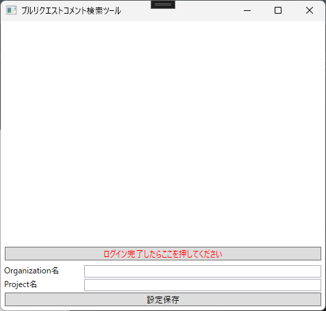
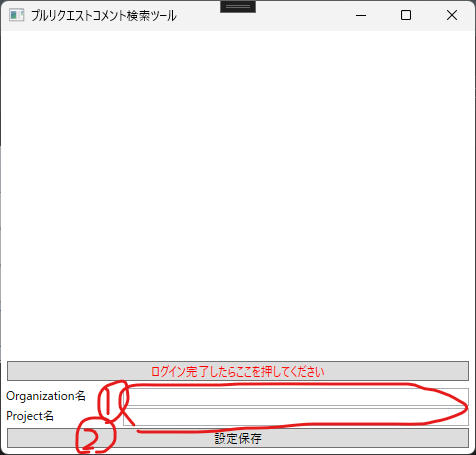
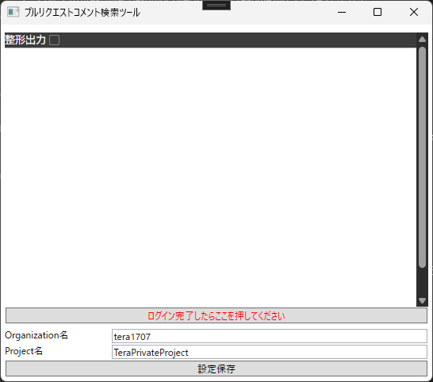
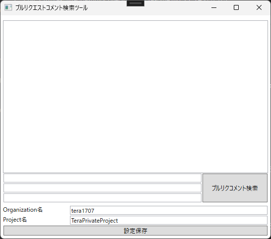
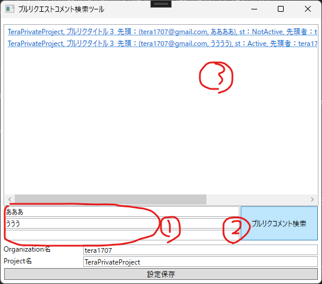

# イメージ

# 概要
AzureDevOpsのプルリクエストの情報を読み出し、下記を行う。
- 全部プルリクのコメントから、指定の文字列を検索し、リスト表示する。
- 自分が今確認するべきプルリク／プルリクコメントをリスト表示する。

# 画面イメージ

起動時画面（MSアカウントログイン画面）

プルリクコメント検索画面

# 機能

## 基本機能

- 指定のOrganization、Projectに出されているプルリクエストの情報を取得する。  
（リポジトリ名の指定はさせない。Projectの中に含まれる全リポジトリの情報を取得する）
- Organization、Projectは、画面から入力する。
- 起動後、ブラウザ画面を表示し、MSアカウントにログインさせる。
- ログインしたユーザーで、Azureにアクセスし、情報を取得する。  
（情報は、RestAPIで取得する）

## プルリクコメント検索機能

- 全プルリクのコメントから、指定の文字列を検索し、ヒットしたコメントを画面上にリストアップする。
- 同時に、ログファイルにも出力する。
- リストの項目をクリックすると、該当のコメントをブラウザで開く。
- 検索文字列は、n個まで指定できる（すべてをorで検索する）
- 検索文字列をなにも入力しないと、すべてのプルリクのすべてのコメントをリストアップする。
- ログファイルも同様。

## 設定保存機能

- Organization、Projectは、1件保存することができる。
- 「設定保存」ボタンを押すと、設定を保存できる。  
（保存先は、exeと同じ階層にある「RepoInfo.txt」ファイル）  
（起動時に「RepoInfo.txt」ファイルがあれば読み込んで、画面にそのOrganization、Projectを表示する  
　なければ画面は空欄にする）

# 操作方法

起動後、「プルリクコメント検索機能」の画面が表示される。

コメントを検索したいAzureのOrganization名、Project名(①)を入れて、設定保存ボタン(②)を押し、一度アプリを終了する。

再度アプリを起動すると、入力したOrganizationにログインしに行く。

ログインに成功したら、ログインのために仮で読み込んだ情報のjsonが表示される。

表示されたら、「ログイン完了したらここを押してください」を押す。

プルリク検索画面が表示される。

検索ワード欄(①)に検索したい文言を入力して、プルリクコメント検索ボタン(②)を押すと、指定の文言を含むプルリクコメントを表示(③)する。  
表示したコメントをクリックすると、webブラウザでそのコメントを表示する。

